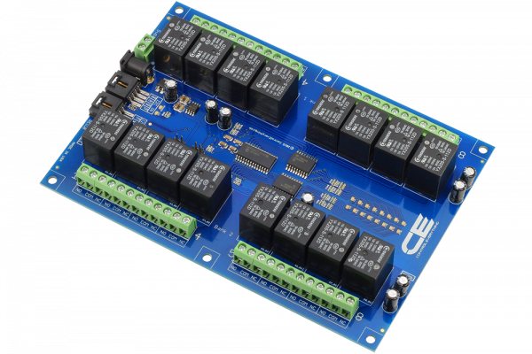

# Arduino_Library_MCP23017_16Channel_Relay_Controller
 .

# MCP23017
MCP23017 is a 16-Channel General Purpose SPDT Relay Controller Driver.
This Device is available from www.ncd.io [SKU: MCP23017_I2CS]
(https://store.ncd.io/product/16-channel-general-purpose-spdt-relay-controller-with-i2c-interface/)
This Sample code can be used with Arduino.

Hardware needed to interface MCP23017 16-Channel General Purpose SPDT Relay Controller Driver with Arduino
1. <a href="https://store.ncd.io/product/i2c-shield-for-arduino-nano/">Arduino Nano</a>
2. <a href="https://store.ncd.io/product/i2c-shield-for-arduino-micro-with-i2c-expansion-port/">Arduino Micro</a>
3. <a href="https://store.ncd.io/product/i2c-shield-for-arduino-uno/">Arduino uno</a>
4. <a href="https://store.ncd.io/product/dual-i2c-shield-for-arduino-due-with-modular-communications-interface/">Arduino Due</a>
5. <a href="https://store.ncd.io/product/16-channel-general-purpose-spdt-relay-controller-with-i2c-interface/">MCP23017 16-Channel General Purpose SPDT Relay Controller Driver</a>
6. <a href="https://store.ncd.io/product/i%C2%B2c-cable/">I2C Cable</a>

## Arduino
Download and install Arduino Software (IDE) on your machine. Steps to install Arduino are provided at:

https://www.arduino.cc/en/Main/Software

Download (or git pull) the code and double click the file to run the program.
Compile and upload the code on Arduino IDE and see the output on Serial Monitor.
